<p align="center">
<a href="https://www.typescriptlang.org/" target="_blank" rel="noreferrer">
    
  </a>
  <a href="http://nestjs.com/" target="blank"></a>
  <a href="https://graphql.org/" target="_blank" rel="noreferrer">
    
  </a>      
  <a href="https://kafka.apache.org/" target="_blank" rel="noreferrer">
    
  </a>
  <a href="https://www.elastic.co/" target="_blank" rel="noreferrer">
    
  </a>
  <a href="https://www.elastic.co/logstash/" target="_blank" rel="noreferrer">
    
  </a>
  <a href="https://www.elastic.co/kibana/" target="_blank" rel="noreferrer">
    
  </a>
  <a href="https://redis.io/" target="_blank" rel="noreferrer">
    
  </a>
  <a href="https://grpc.io/" target="_blank" rel="noreferrer">
    
  </a>
  <a href="https://www.docker.com/" target="_blank" rel="noreferrer">
    
  </a>
  <a href="https://www.postgresql.org/" target="_blank" rel="noreferrer">
    
  </a>
  <a href="https://www.prisma.io/" target="_blank" rel="noreferrer">
    
  </a>
  <a href="https://jestjs.io/" target="_blank" rel="noreferrer">
    
  </a>
  <a href="https://nodejs.org/en" target="_blank" rel="noreferrer">
    
  </a>
  <a href="https://www.npmjs.com/" target="_blank" rel="noreferrer">
    
  </a> 
</p>

# EasyStore Backend Repository

## Table of Contents

- [Getting Started](#getting-started)
  - [Development Environment](#development-environment)
  - [Production Environment](#production-environment)
  - [Documentation](#documentation)
- [Architecture and Patterns](#architecture-and-patterns)
  - [Core Architecture](#core-architecture)
  - [Key Patterns](#key-patterns)
  - [Database ERD](#database-entity-relationship-diagram-erd)

## Getting Started

Follow these instructions to set up and run the EasyStore backend application:

### Development Environment

1. Navigate to the application directory:

   ```bash
   cd easystore-backend
   ```

2. Install dependencies:

   ```bash
   npm install
   ```

3. Set up environment variables:

   ```bash
   cp .env.example .env
   ```

4. Run database migrations to create PostgreSQL models:

   ```bash
   npm run database
   ```

5. Start the development server:

   ```bash
   npm run dev
   ```

> [!TIP]
> Alternatively, you can use Docker for development:

```bash
npm run docker:dev
```

#### Testing Kafka

1. Start services:

```bash
  npm run docker:kafka:up
```

2. Send test messages:

```bash
npm run kafka:producer:test
```

3. Verify processing:

```bash
npm run kafka:consumer:test
```

### Production Environment

To run the application in production mode:

```bash
npm run build
npm run start
```

> [!TIP]
> Alternatively, you can use Docker for production:

```bash
npm run docker
```

> [!NOTE]
> Prisma schemas are located at src/infrastructure/database containing PostgreSQL models.

### Documentation
The following endpoint will be available for API exploration:

GraphQL Playground & Documentation: /gql

The Apollo Playground provides an interactive environment to:

- Explore the GraphQL schema
- Test queries and mutations
- View documentation for all types and fields

## Architecture and Patterns

### Core Architecture
- **Domain-Driven Design (DDD)**
  - Strategic patterns: Bounded Contexts, Ubiquitous Language
  - Tactical patterns: Aggregates, Entities, Value Objects
  - Layered architecture with clear separation between:
    - Domain layer (business logic)
    - Application layer (use cases/coordination)
    - Infrastructure layer (technical implementations)
    - Presentation layer (graphql resolvers and types)

### Key Patterns
1. **Command Query Responsibility Segregation (CQRS)**
   - Separate models for:
     - Commands (write operations with business validation)
     - Queries (read operations with optimized projections)
   - Event sourcing for critical domain operations

2. **Repository Pattern**
   - Abstract data access through `IRepository` interfaces
   - Database-agnostic domain layer
   - Concrete implementations in infrastructure layer

3. **Factory Pattern**
   - Domain object creation through dedicated factories
   - Complex aggregate construction
   - Validation during object creation
   - Pattern implementations:
     - Static factory methods for simple objects
     - Builder pattern for complex aggregates

### Database Entity-Relationship Diagram (ERD)
<div align="center">
  
</div>