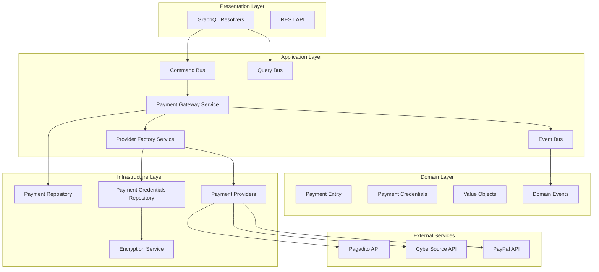
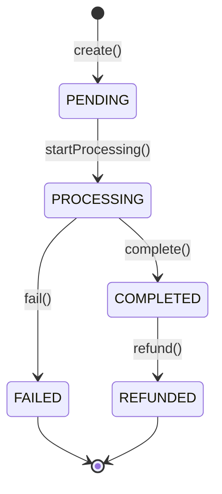

# Payment Gateway

## Overview

The Payment Gateway module provides a unified interface for processing payments across multiple providers (Pagadito, CyberSource/VisaNet, PayPal) while maintaining strict security standards and comprehensive audit trails.

## Architecture

### Core Design Principles

- **Provider Agnostic**: Single interface for all payment operations
- **Domain-Driven Design**: Clear separation of business logic and infrastructure
- **CQRS Pattern**: Command/Query separation for optimal performance
- **Event-Driven**: Asynchronous processing with domain events
- **Security First**: AES-256 encryption for sensitive credentials

### System Architecture



## Core Components

### Payment Entity

Central aggregate that encapsulates payment state and business rules:

```typescript
class PaymentEntity {
  // Core properties
  id: PaymentIdVO;
  tenantId: string;
  providerType: PaymentProviderTypeVO;
  amount: PaymentAmountVO;
  currency: CurrencyVO;
  status: PaymentStatusVO;

  // Business methods
  create(): void;
  startProcessing(): void;
  complete(transactionId: string): void;
  fail(reason: string): void;
  refund(amount: PaymentAmountVO): void;
}
```

### Payment Status Flow



### Provider Factory

Dynamic provider instantiation based on tenant configuration:

```typescript
class PaymentProviderFactoryService {
  async getProvider(
    tenantId: string,
    providerType: string,
  ): Promise<PaymentProvider> {
    const credentials = await this.credentialsService.getDecryptedCredentials(
      tenantId,
      PaymentProviderTypeVO.fromString(providerType),
    );

    switch (providerType) {
      case 'PAGADITO':
        return new PagaditoProvider(credentials);
      case 'VISANET':
        return new VisanetProvider(credentials);
      case 'PAYPAL':
        return new PaypalProvider(credentials);
    }
  }
}
```

## Configuration

### Environment Variables

```bash
# Encryption
PAYMENT_CREDENTIALS_ENCRYPTION_KEY=your-32-char-key
PAYMENT_CREDENTIALS_SALT=your-salt-value

# CyberSource
CYBERSOURCE_MERCHANT_ID=your-merchant-id
CYBERSOURCE_API_KEY=your-api-key
CYBERSOURCE_SECRET_KEY=your-secret-key
CYBERSOURCE_RUN_ENVIRONMENT=sandbox|production

# Pagadito
PAGADITO_USERNAME=your-username
PAGADITO_PASSWORD=your-password
PAGADITO_TOKEN=your-token

# PayPal
PAYPAL_CLIENT_ID=your-client-id
PAYPAL_CLIENT_SECRET=your-client-secret
PAYPAL_MODE=sandbox|live
```

### Credential Management

Payment provider credentials are encrypted using AES-256-CBC with PBKDF2 key derivation:

```typescript
class CredentialsEncryptionService {
  encrypt(credentials: Record<string, unknown>): string {
    const key = this.getEncryptionKey();
    const iv = crypto.randomBytes(16);
    const salt = crypto.randomBytes(32);
    const derivedKey = crypto.pbkdf2Sync(key, salt, 100000, 32, 'sha512');

    const cipher = crypto.createCipheriv('aes-256-cbc', derivedKey, iv);
    const encrypted = cipher.update(
      JSON.stringify(credentials),
      'utf8',
      'base64',
    );

    return `${iv.toString('base64')}:${encrypted}`;
  }
}
```

## API Reference

### GraphQL Mutations

#### Initiate Payment

```graphql
mutation InitiatePayment($input: InitiatePaymentInput!) {
  initiatePayment(input: $input) {
    success
    transactionId
    checkoutUrl
    error
    correlationId
    status
    environment
  }
}
```

**Input:**

```typescript
type InitiatePaymentInput {
  tenantId: String!
  providerType: String! # PAGADITO, VISANET, PAYPAL
  amount: Float!
  currency: String!
  orderId: String
  externalReferenceNumber: String
  details: [PaymentDetailInput!]
  customParams: String
  allowPendingPayments: Boolean
  visanetCard: VisanetCardInput
  pagaditoCard: PagaditoCardInput
}
```

#### Complete Payment

```graphql
mutation CompletePayment(
  $tenantId: String!
  $providerType: String!
  $paymentId: String!
) {
  completePayment(
    tenantId: $tenantId
    providerType: $providerType
    paymentId: $paymentId
  ) {
    success
    transactionId
    error
    correlationId
    status
    environment
  }
}
```

#### Refund Payment

```graphql
mutation RefundPayment(
  $tenantId: String!
  $providerType: String!
  $paymentId: String!
  $amount: Float
) {
  refundPayment(
    tenantId: $tenantId
    providerType: $providerType
    paymentId: $paymentId
    amount: $amount
  ) {
    success
    transactionId
    error
    correlationId
    status
    environment
  }
}
```

### GraphQL Queries

#### Get Payment

```graphql
query GetPayment($tenantId: String!, $paymentId: String!) {
  getPayment(tenantId: $tenantId, paymentId: $paymentId)
}
```

#### List Payments

```graphql
query ListPayments($tenantId: String!, $limit: Int, $offset: Int) {
  listPayments(tenantId: $tenantId, limit: $limit, offset: $offset)
}
```

## Development Guide

### Setting Up Credentials

1. **Create Tenant Credentials:**

```graphql
mutation CreatePaymentCredentials($input: CreatePaymentCredentialsInput!) {
  createPaymentCredentials(input: $input)
}
```

**Input Example:**

```json
{
  "input": {
    "tenantId": "tenant-uuid",
    "providerType": "VISANET",
    "credentials": {
      "merchantId": "your-merchant-id",
      "apiKey": "your-api-key",
      "secretKey": "your-secret-key",
      "runEnvironment": "sandbox"
    }
  }
}
```

### Testing Payments

#### 1. Configure Provider Credentials

```bash
curl -X POST http://localhost:3001/gql \
  -H "Content-Type: application/json" \
  -d '{
    "query": "mutation { createPaymentCredentials(input: { tenantId: \"0199c6c2-4054-70fe-812b-fcd28d4e3ef7\", providerType: \"VISANET\", credentials: { merchantId: \"test_merchant\", apiKey: \"test_key\", secretKey: \"test_secret\", runEnvironment: \"sandbox\" } }) }"
  }'
```

#### 2. Initiate Payment

```bash
curl -X POST http://localhost:3001/gql \
  -H "Content-Type: application/json" \
  -d '{
    "query": "mutation { initiatePayment(input: { tenantId: \"0199c6c2-4054-70fe-812b-fcd28d4e3ef7\", providerType: \"VISANET\", amount: 100.00, currency: \"USD\", orderId: \"order-123\", details: [{ quantity: 1, description: \"Test Product\", price: 100.00 }], visanetCard: { cardNumber: \"4111111111111111\", expirationDate: \"12/25\", cvv: \"123\", firstName: \"John\", lastName: \"Doe\", email: \"john@example.com\" } }) { success transactionId error } }"
  }'
```

#### 3. Complete Payment

```bash
curl -X POST http://localhost:3001/gql \
  -H "Content-Type: application/json" \
  -d '{
    "query": "mutation { completePayment(tenantId: \"0199c6c2-4054-70fe-812b-fcd28d4e3ef7\", providerType: \"VISANET\", paymentId: \"pay_1234567890_abc123\") { success transactionId error } }"
  }'
```

#### 4. Refund Payment

```bash
curl -X POST http://localhost:3001/gql \
  -H "Content-Type: application/json" \
  -d '{
    "query": "mutation { refundPayment(tenantId: \"0199c6c2-4054-70fe-812b-fcd28d4e3ef7\", providerType: \"VISANET\", paymentId: \"pay_1234567890_abc123\", amount: 50.00) { success transactionId error } }"
  }'
```

### Database Schema

#### Payment Table

```sql
CREATE TABLE sales.Payment (
  id VARCHAR PRIMARY KEY,
  amount DECIMAL NOT NULL,
  status Status NOT NULL,
  transactionId VARCHAR,
  orderId VARCHAR,
  paymentMethodId VARCHAR NOT NULL,
  subscriptionId VARCHAR NOT NULL,
  createdAt TIMESTAMP DEFAULT NOW(),
  updatedAt TIMESTAMP DEFAULT NOW()
);
```

#### Payment Provider Credential Table

```sql
CREATE TABLE sales.PaymentProviderCredential (
  id VARCHAR PRIMARY KEY,
  tenantId VARCHAR NOT NULL,
  provider ProviderType NOT NULL,
  credentials TEXT NOT NULL, -- Encrypted
  createdAt TIMESTAMP DEFAULT NOW(),
  updatedAt TIMESTAMP DEFAULT NOW(),
  UNIQUE(tenantId, provider)
);
```

## Provider-Specific Implementation

### CyberSource/VisaNet

**Features:**

- Card tokenization
- 3D Secure authentication
- Fraud detection
- Recurring payments

**Configuration:**

```typescript
interface VisanetCredentials {
  merchantId: string;
  apiKey: string;
  secretKey: string;
  runEnvironment: 'sandbox' | 'production';
}
```

### Pagadito

**Features:**

- Bank transfers
- Credit/debit cards
- Mobile payments
- QR code payments

**Configuration:**

```typescript
interface PagaditoCredentials {
  username: string;
  password: string;
  token: string;
  environment: 'sandbox' | 'production';
}
```

### PayPal

**Features:**

- Express Checkout
- Subscriptions
- Marketplace payments
- Mobile SDK integration

**Configuration:**

```typescript
interface PaypalCredentials {
  clientId: string;
  clientSecret: string;
  mode: 'sandbox' | 'live';
}
```

## Security Considerations

### Data Protection

- **Encryption at Rest**: All credentials encrypted with AES-256-CBC
- **Key Derivation**: PBKDF2 with 100,000 iterations
- **Secure Storage**: No plaintext credentials in database
- **Access Control**: Tenant-scoped credential access

### PCI Compliance

- **No Card Data Storage**: Card numbers never stored
- **Tokenization**: Use provider tokenization services
- **Secure Transmission**: HTTPS/TLS 1.3 for all communications
- **Audit Logging**: Comprehensive payment event logging

### Error Handling

```typescript
class PaymentError extends Error {
  constructor(
    public readonly code: string,
    public readonly providerError?: unknown,
    public readonly retryable: boolean = false,
  ) {
    super(`Payment error: ${code}`);
  }
}
```

## Monitoring and Observability

### Domain Events

```typescript
// Payment initiated
class PaymentInitiatedEvent {
  constructor(
    public readonly paymentId: string,
    public readonly tenantId: string,
    public readonly amount: number,
    public readonly providerType: string,
  ) {}
}

// Payment completed
class PaymentCompletedEvent {
  constructor(
    public readonly paymentId: string,
    public readonly transactionId: string,
    public readonly amount: number,
  ) {}
}
```

### Logging Strategy

```typescript
// Structured logging for payment operations
this.logger.log('Payment initiated', {
  paymentId: payment.id.value,
  tenantId: payment.tenantId,
  amount: payment.amount.value,
  providerType: payment.providerType.value,
  correlationId: correlationId,
});
```

### Metrics

- Payment success rate by provider
- Average processing time
- Error rate by error type
- Revenue metrics by tenant

## Troubleshooting

### Common Issues

**1. Invalid Credentials**

```
Error: Payment error: INVALID_CREDENTIALS
```

**Solution:** Verify credential configuration and provider environment settings.

**2. Insufficient Funds**

```
Error: Payment error: INSUFFICIENT_FUNDS
```

**Solution:** Check account balance or card limits.

**3. Network Timeout**

```
Error: Payment error: NETWORK_TIMEOUT
```

**Solution:** Implement retry logic with exponential backoff.

### Debug Mode

Enable detailed logging by setting log level to `debug`:

```typescript
// In main.ts
const app = await NestFactory.create(AppModule, {
  logger: ['error', 'warn', 'log', 'debug', 'verbose'],
});
```

## Performance Optimization

### Caching Strategy

- **Credential Caching**: Cache decrypted credentials for 5 minutes
- **Provider Instances**: Reuse provider instances when possible
- **Database Connections**: Connection pooling for high throughput

### Async Processing

- **Event-Driven**: Use domain events for non-critical operations
- **Background Jobs**: Process refunds and notifications asynchronously
- **Queue Management**: Implement retry queues for failed operations

### Scaling Considerations

- **Horizontal Scaling**: Stateless design allows horizontal scaling
- **Database Sharding**: Partition payments by tenant ID
- **CDN Integration**: Cache static payment forms and assets
