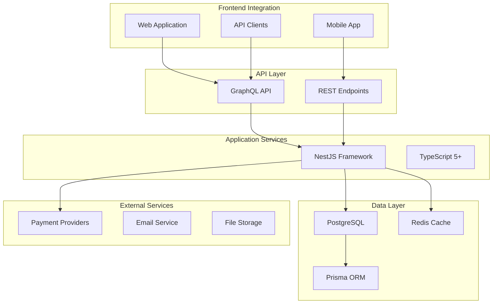

# EasyStore Services Documentation

## Overview

This centralized documentation hub provides comprehensive guides for all EasyStore Services modules. Each module follows Domain-Driven Design principles with clear separation of concerns, ensuring maintainable and scalable architecture.

## Quick Navigation

### Available Modules

| Module                 | Status              | Documentation                          | Description                              |
| ---------------------- | ------------------- | -------------------------------------- | ---------------------------------------- |
| **Payment Gateway**    | ✅ Production Ready | [Complete Guide](./PAYMENT_GATEWAY.md) | Multi-provider payment processing system |
| **Authentication**     | 🚧 In Development   | _Coming Soon_                          | User authentication and authorization    |
| **Product Management** | 📋 Planned          | _Coming Soon_                          | Product catalog and inventory management |
| **Tenant Management**  | 📋 Planned          | _Coming Soon_                          | Multi-tenant architecture support        |

## Architecture Overview

### Core Design Principles

- **Domain-Driven Design (DDD)**: Strategic and tactical patterns for complex business logic
- **Clean Architecture**: Clear separation between domain, application, and infrastructure layers
- **CQRS Pattern**: Command/Query Responsibility Segregation for optimal performance
- **Event-Driven Architecture**: Asynchronous processing with domain events
- **Security First**: Comprehensive encryption and audit trails

### Technology Stack



## Module Documentation

### Payment Gateway Module

**Status**: Production Ready  
**Documentation**: [Complete Guide](./PAYMENT_GATEWAY.md)

The Payment Gateway module provides a unified interface for processing payments across multiple providers while maintaining strict security standards and comprehensive audit trails.

**Key Features**:

- Multi-provider support (Pagadito, CyberSource/VisaNet, PayPal)
- AES-256 encryption for sensitive credentials
- Comprehensive audit logging
- Provider-agnostic abstraction
- Real-time payment processing
- Refund and dispute management

**Quick Start**:

1. Configure payment provider credentials
2. Initialize payment with order details
3. Process payment through selected provider
4. Handle webhooks and notifications
5. Manage refunds and disputes

### Authentication Module

**Status**: In Development  
**Documentation**: _Coming Soon_

User authentication and authorization system with JWT tokens, role-based access control, and multi-tenant support.

**Planned Features**:

- JWT-based authentication
- Role-based authorization
- Multi-tenant user management
- OAuth2 integration
- Password reset and recovery
- Session management

### Product Management Module

**Status**: Planned  
**Documentation**: _Coming Soon_

Comprehensive product catalog management with inventory tracking, pricing, and categorization.

**Planned Features**:

- Product catalog management
- Inventory tracking
- Pricing and promotions
- Category management
- Media attachments
- Search and filtering

### Tenant Management Module

**Status**: Planned  
**Documentation**: _Coming Soon_

Multi-tenant architecture support for scalable SaaS operations.

**Planned Features**:

- Tenant isolation
- Resource management
- Billing and subscription
- Custom branding
- Data segregation

## Development Guidelines

### Getting Started

1. **Environment Setup**:

   ```bash
   npm install
   cp .env.example .env
   npm run database
   npm run dev
   ```

2. **GraphQL Playground**: Available at `/gql` for API exploration and testing

3. **Database Schema**: Located at `src/infrastructure/database/postgres.schema.prisma`

### Code Standards

- **TypeScript**: Strict mode enabled with comprehensive type checking
- **ESLint**: Enforced code quality and consistency
- **Prettier**: Automated code formatting
- **Jest**: Comprehensive testing framework
- **Prisma**: Type-safe database access

### Architecture Patterns

#### Domain-Driven Design (DDD)

- **Bounded Contexts**: Clear module boundaries
- **Aggregates**: Consistency boundaries for business operations
- **Entities**: Objects with distinct identity
- **Value Objects**: Immutable domain concepts
- **Domain Events**: Business occurrences that trigger side effects

#### CQRS Implementation

- **Commands**: Write operations with business validation
- **Queries**: Read operations with optimized projections
- **Event Sourcing**: Audit trail for critical operations
- **Command/Query Handlers**: Dedicated processing units

#### Repository Pattern

- **Interface Segregation**: Database-agnostic domain layer
- **Concrete Implementations**: Infrastructure-specific implementations
- **Unit of Work**: Transaction management
- **Specification Pattern**: Complex query composition

## Testing Strategy

### Testing Levels

1. **Unit Tests**: Individual component testing
2. **Integration Tests**: Module interaction testing
3. **End-to-End Tests**: Complete workflow validation
4. **Performance Tests**: Load and stress testing

### Test Data Management

- **Test Fixtures**: Consistent test data setup
- **Mock Services**: External service simulation
- **Database Seeding**: Test environment preparation
- **Cleanup Procedures**: Test isolation maintenance

## Deployment and Operations

### Environment Configuration

- **Development**: Local development with hot reload
- **Staging**: Pre-production validation environment
- **Production**: Live system with monitoring and logging

### Monitoring and Logging

- **Structured Logging**: JSON-formatted log entries
- **Audit Trails**: Comprehensive operation tracking
- **Performance Metrics**: System health monitoring
- **Error Tracking**: Exception and error management

### Security Considerations

- **Data Encryption**: Sensitive data protection
- **Access Control**: Role-based permissions
- **API Security**: Rate limiting and validation
- **Compliance**: Industry standard adherence

## Contributing

### Development Workflow

1. **Fork Repository**: Create personal fork
2. **Create Branch**: Feature or bugfix branch
3. **Implement Changes**: Follow coding standards
4. **Write Tests**: Comprehensive test coverage
5. **Update Documentation**: Keep docs current
6. **Submit Pull Request**: Detailed description required

### Code Review Process

- **Automated Checks**: CI/CD pipeline validation
- **Peer Review**: Code quality assessment
- **Security Review**: Vulnerability scanning
- **Performance Review**: Optimization validation

## Support and Resources

### Documentation Links

- **API Reference**: GraphQL schema documentation
- **Architecture Guides**: System design documentation
- **Development Guides**: Implementation best practices
- **Troubleshooting**: Common issues and solutions

### Community and Support

- **GitHub Issues**: Bug reports and feature requests
- **Discussions**: Community conversations
- **Wiki**: Additional resources and guides
- **Slack**: Real-time team communication

---

**EasyStore Services Documentation Hub**  
_Comprehensive guides for scalable e-commerce backend services_  
_Last updated: $(date)_
