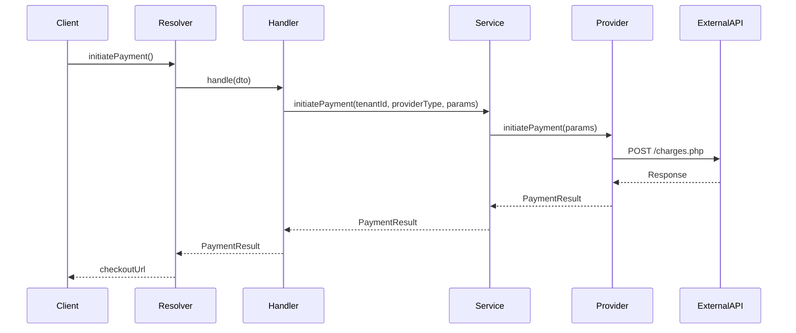

# Payment Gateway Architecture

## Overview

The Payment Gateway domain implements a sophisticated, enterprise-grade payment processing system following Domain-Driven Design (DDD), Clean Architecture, and Event Sourcing principles. This architecture ensures scalability, maintainability, and operational excellence for mission-critical payment operations.

## Architecture Principles

### 1. Domain-Driven Design (DDD)

- **Bounded Context**: Payment Gateway as a distinct domain with clear boundaries
- **Aggregates**: Payment, Provider, and Credential aggregates with defined consistency boundaries
- **Value Objects**: Immutable objects representing domain concepts (PaymentDetailsVO, PagaditoCredentialsVO)
- **Domain Events**: PaymentInitiatedEvent, PaymentCompletedEvent for event-driven communication

### 2. Clean Architecture

- **Dependency Inversion**: High-level modules don't depend on low-level modules
- **Single Responsibility**: Each class has one reason to change
- **Open/Closed Principle**: Open for extension, closed for modification
- **Interface Segregation**: Clients depend only on interfaces they use

### 3. Event Sourcing & CQRS

- **Event Store**: All payment state changes captured as events
- **Command/Query Separation**: Write operations (commands) separate from read operations (queries)
- **Projections**: Multiple read models for different use cases
- **Saga Pattern**: Distributed transactions across multiple payment providers

## Domain Model

### Core Aggregates

#### Payment Aggregate

```typescript
interface Payment {
  id: PaymentIdVO;
  amount: PaymentAmountVO;
  status: PaymentStatusVO;
  providerType: ProviderTypeVO;
  tenantId: string;
  orderId: string;
  externalReferenceNumber: ExternalReferenceNumberVO;
  details: PaymentDetailsVO[];
  events: PaymentEvent[];
}
```

#### Provider Aggregate

```typescript
interface PaymentProvider {
  type: ProviderType;
  credentials: ProviderCredentialsVO;
  capabilities: ProviderCapability[];
  configuration: ProviderConfigVO;
}
```

### Value Objects

#### PaymentDetailsVO

- **Purpose**: Encapsulate payment item details
- **Properties**: quantity, description, price, urlProduct
- **Validation**: Ensures positive quantities and prices
- **Immutability**: All properties readonly

#### PagaditoCredentialsVO

- **Purpose**: Secure credential management for Pagadito
- **Properties**: uid, wsk, sandbox
- **Security**: Encrypted storage, secure transmission
- **Environment**: Automatic endpoint selection based on sandbox flag

#### ExternalReferenceNumberVO

- **Purpose**: Generate and manage external reference numbers
- **Generation**: Time-based unique identifier
- **Format**: ERN-{timestamp}
- **Uniqueness**: Guaranteed across all tenants

## Technical Architecture

### Layer Structure

```
┌─────────────────────────────────────┐
│           Presentation Layer        │
│  ┌─────────────────────────────────┐ │
│  │      GraphQL Resolvers          │ │
│  │      REST Controllers           │ │
│  │      Webhook Handlers           │ │
│  └─────────────────────────────────┘ │
└─────────────────────────────────────┘
┌─────────────────────────────────────┐
│           Application Layer         │
│  ┌─────────────────────────────────┐ │
│  │      Command Handlers           │ │
│  │      Query Handlers             │ │
│  │      Domain Services            │ │
│  │      Application Services       │ │
│  └─────────────────────────────────┘ │
└─────────────────────────────────────┘
┌─────────────────────────────────────┐
│             Domain Layer            │
│  ┌─────────────────────────────────┐ │
│  │      Aggregates                 │ │
│  │      Value Objects              │ │
│  │      Domain Events              │ │
│  │      Domain Services            │ │
│  │      Repository Interfaces      │ │
│  └─────────────────────────────────┘ │
└─────────────────────────────────────┘
┌─────────────────────────────────────┐
│         Infrastructure Layer       │
│  ┌─────────────────────────────────┐ │
│  │      Provider Implementations   │ │
│  │      Repository Implementations │ │
│  │      Event Store                │ │
│  │      External APIs              │ │
│  │      Message Brokers            │ │
│  └─────────────────────────────────┘ │
└─────────────────────────────────────┘
```

### Component Interactions



## API Design

### GraphQL Schema

```graphql
type Mutation {
  initiatePayment(
    tenantId: String!
    providerType: String!
    amount: Float!
    currency: String!
    orderId: String!
    details: [PaymentDetailInput!]
    customParams: String
    allowPendingPayments: Boolean
    externalReferenceNumber: String
  ): String!

  completePayment(
    tenantId: String!
    providerType: String!
    paymentId: String!
  ): String!

  saveOrUpdateProviderKeys(
    tenantId: String!
    providerType: String!
    credentials: String!
  ): Boolean!
}

input PaymentDetailInput {
  quantity: Int!
  description: String!
  price: Float!
  urlProduct: String
}
```

### REST Endpoints

```typescript
// Payment Operations
POST / api / v1 / payments / initiate;
POST / api / v1 / payments / complete;
POST / api / v1 / payments / refund;

// Provider Management
POST / api / v1 / providers / credentials;
GET / api / v1 / providers / status;

// Webhooks
POST / api / v1 / webhooks / pagadito;
POST / api / v1 / webhooks / paypal;
```

## Integration Patterns

### Provider Integration

#### Adapter Pattern

```typescript
interface PaymentProvider {
  initiatePayment(params: InitiatePaymentParams): Promise<PaymentResult>;
  completePayment(params: CompletePaymentParams): Promise<PaymentResult>;
  refundPayment?(params: RefundPaymentParams): Promise<PaymentResult>;
}
```

#### Factory Pattern

```typescript
class PaymentProviderFactory {
  createProvider(
    type: ProviderType,
    credentials: ProviderCredentials,
  ): PaymentProvider {
    switch (type) {
      case 'PAGADITO':
        return new PagaditoProvider(credentials);
      case 'PAYPAL':
        return new PayPalProvider(credentials);
      default:
        throw new UnsupportedProviderError(type);
    }
  }
}
```

### Event-Driven Architecture

#### Domain Events

```typescript
interface PaymentInitiatedEvent {
  aggregateId: PaymentId;
  eventType: 'PaymentInitiated';
  data: {
    amount: number;
    currency: string;
    providerType: string;
    tenantId: string;
  };
  timestamp: Date;
  version: number;
}
```

#### Event Handlers

```typescript
@EventHandler(PaymentInitiatedEvent)
class PaymentInitiatedHandler {
  async handle(event: PaymentInitiatedEvent): Promise<void> {
    // Update read models
    // Send notifications
    // Trigger analytics
  }
}
```

## Security & Compliance

### Data Protection

- **Encryption**: AES-256 for sensitive data at rest
- **Transmission**: TLS 1.3 for all external communications
- **Key Management**: Hardware Security Modules (HSM) for credential storage
- **Access Control**: Role-based access control (RBAC)

### Compliance Standards

- **PCI DSS**: Payment Card Industry Data Security Standard
- **SOX**: Sarbanes-Oxley Act compliance
- **GDPR**: General Data Protection Regulation
- **SOC 2**: Service Organization Control 2

### Security Measures

```typescript
// Credential Encryption
class CredentialEncryptionService {
  async encrypt(
    credentials: ProviderCredentials,
  ): Promise<EncryptedCredentials> {
    const key = await this.getEncryptionKey();
    return this.cryptoService.encrypt(credentials, key);
  }
}

// Input Validation
class PaymentValidationService {
  validateAmount(amount: number): void {
    if (amount <= 0 || amount > MAX_PAYMENT_AMOUNT) {
      throw new InvalidAmountError(amount);
    }
  }
}
```

## Operational Excellence

### Monitoring & Observability

- **Metrics**: Payment success rate, response times, error rates
- **Logging**: Structured logging with correlation IDs
- **Tracing**: Distributed tracing across payment flow
- **Alerting**: Real-time alerts for payment failures

### Performance Optimization

- **Caching**: Redis for frequently accessed data
- **Connection Pooling**: Database and external API connections
- **Async Processing**: Non-blocking payment operations
- **Load Balancing**: Horizontal scaling across multiple instances

### Resilience Patterns

- **Circuit Breaker**: Prevent cascade failures
- **Retry Logic**: Exponential backoff for transient failures
- **Fallback Mechanisms**: Alternative providers on failure
- **Dead Letter Queues**: Failed payment processing

## Testing Strategy

### Test Pyramid

```
    ┌─────────────┐
    │   E2E Tests │ 10%
    └─────────────┘
   ┌───────────────┐
   │ Integration   │ 20%
   │     Tests     │
   └───────────────┘
  ┌─────────────────┐
  │   Unit Tests    │ 70%
  └─────────────────┘
```

### Test Types

- **Unit Tests**: Individual component testing
- **Integration Tests**: Provider API integration
- **End-to-End Tests**: Complete payment flow
- **Performance Tests**: Load and stress testing

## Deployment & Monitoring

### Infrastructure as Code

```yaml
# Docker Compose
version: '3.8'
services:
  payment-gateway:
    image: payment-gateway:latest
    environment:
      - NODE_ENV=production
      - DATABASE_URL=${DATABASE_URL}
    ports:
      - '3000:3000'
```

### Kubernetes Deployment

```yaml
apiVersion: apps/v1
kind: Deployment
metadata:
  name: payment-gateway
spec:
  replicas: 3
  selector:
    matchLabels:
      app: payment-gateway
  template:
    metadata:
      labels:
        app: payment-gateway
    spec:
      containers:
        - name: payment-gateway
          image: payment-gateway:latest
          ports:
            - containerPort: 3000
```

## Implementation Guidelines

### Code Organization

```
src/domains/payment-gateway/
├── aggregates/
│   ├── entities/
│   ├── value-objects/
│   ├── events/
│   └── repositories/
├── application/
│   ├── commands/
│   ├── queries/
│   ├── services/
│   └── events/
├── infrastructure/
│   ├── providers/
│   ├── persistence/
│   ├── messaging/
│   └── external/
└── presentation/
    ├── graphql/
    ├── rest/
    └── webhooks/
```

### Naming Conventions

- **Aggregates**: PascalCase (Payment, Provider)
- **Value Objects**: PascalCase with VO suffix (PaymentDetailsVO)
- **Events**: PascalCase with Event suffix (PaymentInitiatedEvent)
- **Services**: PascalCase with Service suffix (PaymentGatewayService)

### Error Handling

```typescript
// Domain Errors
class PaymentFailedError extends DomainError {
  constructor(
    message: string,
    public readonly paymentId: string,
  ) {
    super(message);
  }
}

// Application Errors
class ProviderUnavailableError extends ApplicationError {
  constructor(public readonly providerType: string) {
    super(`Provider ${providerType} is currently unavailable`);
  }
}
```

---

_This architecture document serves as the foundation for building a robust, scalable, and maintainable payment processing system that meets enterprise-grade requirements._
